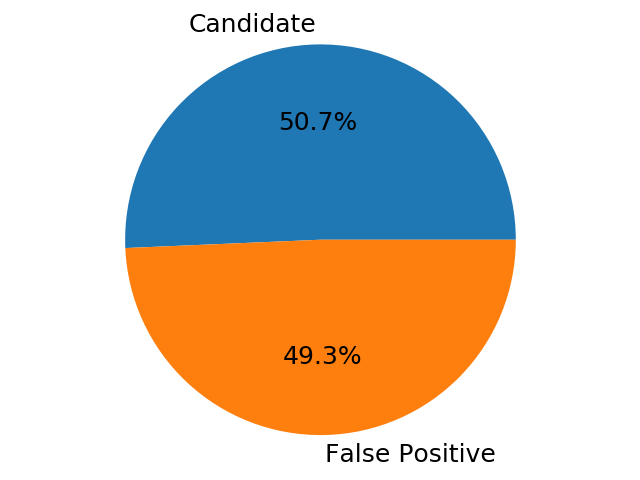
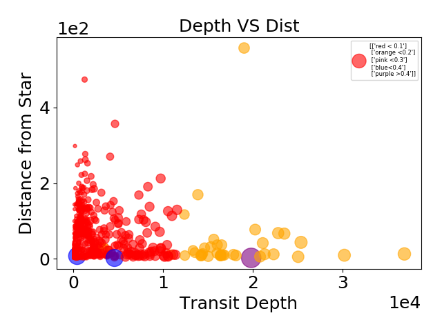
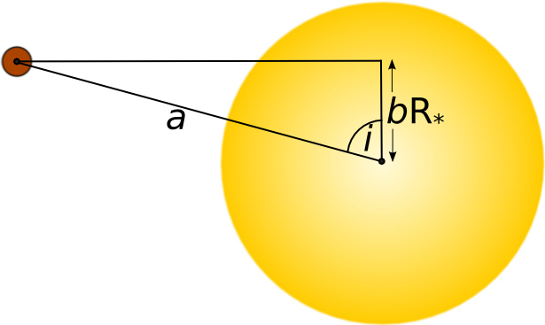
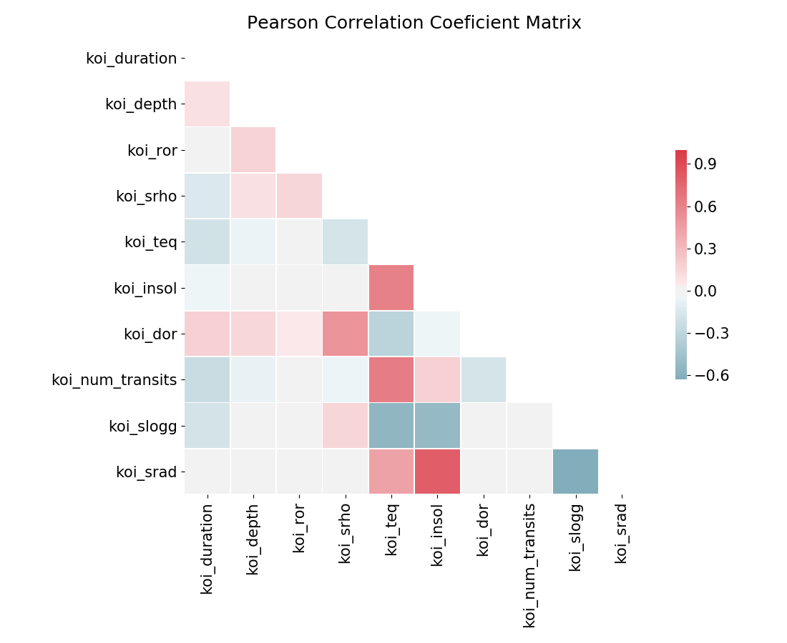
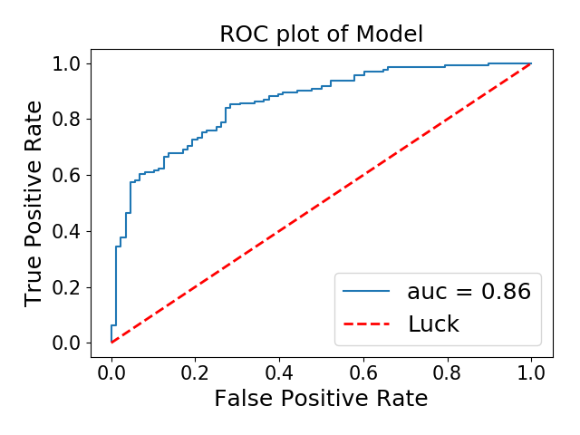

# Finding Other Worlds
### Identifying Exoplanets From Kepler Data

#### Background
On March 6th, 2009, NASA launched the [Kepler Telescope](https://www.nasa.gov/mission_pages/kepler/launch/index.html) in order to detect potential exoplanets - planets orbiting stars outside of our own solar system. To do this, Kepler mapped the brightness of the stars over time, called the light curve. As an exoplanet passes in front of its star relative to Earth, called the transit, it causes a slight decrease in the star's light curve. This dip is called the transit depth. These data can also be used to determine an exoplanet's size, orbital period, distance from star, and more. NASA has now [discovered](https://www.nasa.gov/kepler/discoveries) 2,327 confirmed exoplanets and 2,244 exoplanet candidates.

[ source](https://www.cfa.harvard.edu/~avanderb/tutorial/tutorial.html)

#### EDA
A subset of data from the [NASA Exoplanet Archive](https://exoplanetarchive.ipac.caltech.edu/cgi-bin/TblView/nph-tblView?app=ExoTbls&config=koi) was utilized for this project. The data includes two exoplanet disposition columns: the koi disposition column contains two categories for exoplanets: candidates and false positives; the second disposition column contains three categories for exoplanets: false positives, confirmed exoplanets, and candidates. For this project, I modeled whether a body is a candidate exoplanet or a false positive using logistic regression.

Looking at the koi_pdisposition column in the data,  candidates comprise 50.7% of the sample. A model is feasible given the proportion of candidates to false positives.

###### Potential false positives given by data [code book](https://exoplanetarchive.ipac.caltech.edu/docs/API_kepcandidate_columns.html#pdisposition):

APO: "Active Pixel Offset" The pixels showing the transit do not coincide with the target star, indicating that the transit is actually on a background object.

Binary: Indicates the transit event is due to an eclipsing binary, not a planet.  

EB: Target is an eclipsing binary, or there is an unresolved background binary.

Odd-even: The depth of the even-numbered transits are statistically different than the depths of the odd-numbered transits; this is a sign of a background eclipsing binary.

V-shaped: Likely a grazing eclipsing binary.
SB1: Target star is a single-lined spectroscopic binary.
SB2: Target star is a double-lined spectroscopic binary.

###### Data Visualization
Using the second disposition column which identifies confirmed candidates, I looked at the expected parameters for an exoplanet. The plot below shows the transit depth vs. the distance between the planet and the star on the x and y coordinates with point size and color indicating planet size relative to the star size.  

Small planets that are close to their star and have high transit depth
Some planets are far from their star and are smaller relative to their star, yet still have a large transit depth. This is due to the fact that they have a large impact parameter so the observable part of the star during transit is mostly from the limb darkening of the star. The limb darkening is the outer edge of a star that appears dimmer than the center.

[source](https://www.paulanthonywilson.com/exoplanets/exoplanet-detection-techniques/the-exoplanet-transit-method/)

So as the impact parameter (b) increases, the further the planet is from the center of the star with respect to us.
Therefore, a large impact parameter means the planet is blocking more of the center of the Star and as such, it's blocking a higher intensity of light.

###### Cleaning
I first removed the columns that I knew would be collinear to other data columns and/or would not affect the predictive model. These columns included the error columns as these are collinearly related to the original data columns, naming columns, since the dataset already has unique indices for all of the data, and other unrelated columns. I also removed the second disposition column since this first model will predict exoplanet candidates from false positives only.
Next, I ran a VIF test to remove further collinear columns over a VIF of 10. One of the columns removed was the impact parameter (see outliers section) because of its correlation with the transit depth.

###### Dataset used for modeling:

|     |   koi_duration  |   koi_depth |   koi_ror |   koi_srho |   koi_teq |   koi_insol |   koi_dor |   koi_num_transits |   koi_slogg |   koi_srad |
|----:|---------------:|------------:|----------:|-----------:|----------:|------------:|----------:|-------------------:|------------:|-----------:|
| 386 |          0.027 |       0.007 |     0.025 |      0     |     0.408 |       0.028 |         0 |              0.316 |       0.655 |      0.026 |
| 158 |          0.11  |       0.004 |     0.002 |      0     |     0.11  |       0     |         0 |              0.033 |       0.819 |      0.009 |
| 768 |          0.079 |       0.001 |     0.001 |      0.001 |     0.138 |       0     |         0 |              0.048 |       0.8   |      0.01  |
| 327 |          0.032 |       0.003 |     0.02  |      0     |     0.32  |       0.011 |         0 |              0.8   |       0.83  |      0.007 |
| 226 |          0.071 |       0.025 |     0.006 |      0.002 |     0.15  |       0.001 |         0 |              0.066 |       0.818 |      0.009 |
| 469 |          0.044 |       0.143 |     0.016 |      0.001 |     0.189 |       0.001 |         0 |              0.193 |       0.834 |      0.008 |
| 653 |          0.054 |       0.261 |     0.037 |      0.003 |     0.145 |       0     |         0 |              0.073 |       0.813 |      0.009 |
| 381 |          0.047 |       0.001 |     0.017 |      0     |     0.15  |       0.001 |         0 |              0.073 |       0.801 |      0.009 |
| 148 |          0.039 |       0.036 |     0.007 |      0.007 |     0.108 |       0     |         0 |              0.051 |       0.842 |      0.007 |
| 313 |          0.077 |       0.001 |     0.025 |      0     |     0.12  |       0     |         0 |              0.027 |       0.766 |      0.011 |

#### Column Terms:

|       koi_duration       |             koi_depth             |          koi_ror         | koi_srho                         | koi_teq                           | koi_insol                     | koi_dor                                | koi_num_transits   | koi_slogg                                | koi_srad                      |
|:------------------------:|:---------------------------------:|:------------------------:|----------------------------------|-----------------------------------|-------------------------------|----------------------------------------|--------------------|------------------------------------------|-------------------------------|
| Transit Duration [hours] | Transit Depth [parts per million] | Planet-Star Radius Ratio | Fitted Stellar Density  [g/cm*3] | Equilibrium Temperature  [Kelvin] | Insolation Flux  [Earth flux] | Planet-Star Distance  over Star Radius | Number of Transits | Stellar Surface Gravity  [log10(cm s-2)] | Stellar Radius  [solar radii] |

#### Model

The test data was trained with a logistic regression model since the target was binary. My goal was to maximize the recall of my model because it was more important to capture all potential exoplanet candidates even if that meant that some false positives might also be captured. As such, the goal of the model was to have a higher sensitivity over specificity.

###### Coefficients
Below is a table of the dependent parameters and their coefficient terms. Most of the parameters have a significant correlation.

|    |   duration |   depth |   relative_size |   stellar_density |   temp_planet |   insolation_flux |   num_transits |   stellar_surface_gravity |   stellar_radius |
|---:|-----------:|--------:|----------------:|------------------:|--------------:|------------------:|---------------:|--------------------------:|-----------------:|
|  0 |      -1.71 |   -4.21 |           -2.86 |              0.29 |         -3.43 |              0.29 |           -2.6 |                      1.08 |            -0.12 |

###### Model Validity

Looking at my ROC curve, the model performed well, with an auc of .86. The area measures discrimination, that is, the ability of the model to correctly classify candidate exoplanets and false positives.

|    |   Precision |   Recall |
|---:|------------:|---------:|
|  1 |       0.733 |    0.981 |

Confusion matrix:

|        |True|False|
|-------:|---:|----:|
|Positive|159 |58   |
|Negative|30  |3    |

The precision and recall were also good. The recall was especially high, indicating that the model successfully minimized the number of false negatives.

#### Future Work
For future modeling of this dataset, I would want to focus on a multinomial logistic regression to predict  confirmed exoplanets as well as the candidates and false positives. I would also want to model additional types of false positive parameters included in the dataset. My final goal would be predicting earth-like exoplanets that could potentially sustain life.
